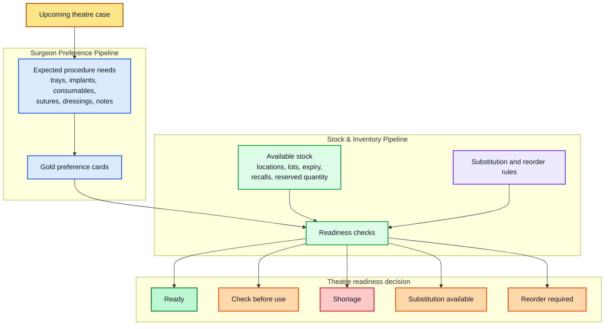

# Surgical Data Platform

This repository is a healthcare data engineering portfolio project built from
real operating theatre experience. It shows how everyday surgical workflow
problems can be turned into reliable data pipelines, dashboards, and operational
tools.

The project uses **synthetic data only**. It does not contain real patient data,
staff records, theatre lists, hospital stock records, or confidential hospital
information.

Live project site: [www.surgeonpreference.com](https://www.surgeonpreference.com)

---

## What This Platform Is For

Operating theatres depend on a lot of information being correct at the right
time: surgeon preferences, instruments, implants, consumables, theatre stock,
case lists, anaesthetic needs, equipment, and local team knowledge.

In many hospitals, this information is split across spreadsheets, paper notes,
stock cupboards, supplier systems, scanning systems, emails, and people's
memory. When the data is hard to trust, theatres can lose time checking,
chasing, substituting, delaying, or reordering things at short notice.

This platform explores how surgical operations data can be made:

- easier for theatre teams to review
- safer to audit
- cleaner for analytics
- reusable across connected pipelines
- ready for future cloud deployment and AI use cases

The aim is not just to store data. The aim is to support practical theatre
questions like:

- What does this surgeon need for this procedure?
- Are we ready for tomorrow's list?
- Which stock items are short, expired, recalled, or awaiting sterilisation?
- What can be substituted safely?
- What needs reordering?
- Which procedures create the most cost or shortage pressure?

---

## Current Progress

Two operational pipelines have been built so far.

### 1. Surgeon Preference Pipeline

**Status: Version 1 complete. Version 2 product workflow in progress.**

This pipeline turns messy surgeon preference information into operational
preference cards that theatre teams can use.

It produces structured cards showing:

- expected instruments and trays
- implants and implant systems
- consumables and disposables
- sutures and dressings
- equipment
- patient positioning
- anaesthetic notes
- skin preparation
- special instructions
- validation warnings and missing-item checks

Version 1 is complete as a working local and Azure-ready data product. It can:

- generate clinically realistic synthetic preference-card data
- process JSON and CSV source files
- clean and validate the data
- enrich records with clinical reference information
- publish operational preference-card outputs
- store audit and metadata records in Postgres
- write outputs to local MinIO or Azure Blob Storage
- run as a Dockerized batch job
- serve the latest preference cards through a Streamlit app
- run in Azure using Azure Blob Storage, Azure Postgres, Azure Container Apps,
  Azure Container Registry, and Azure Data Factory

Version 2 work is focused on turning the pipeline into a more controlled product
workflow:

- user sign-in and access requests
- organisation and role management
- draft preference-card edits
- review and publish workflow
- audit history for access, review, and publishing decisions

### 2. Stock & Inventory Management Pipeline

**Status: Active build. Core local pipeline and dashboard foundations are now in place.**

This pipeline connects stock information with theatre demand. In simple terms,
the Surgeon Preference pipeline says, "This is what the surgeon expects for the
case." The Stock & Inventory pipeline asks, "Do we actually have it, is it safe
to use, and what should we do if we do not?"

The stock pipeline now includes:

- clinically aligned synthetic stock data generation
- manual spreadsheet-style stock checks
- scanner/barcode-style stock event files
- ERP-style stock balance files
- item catalogue, supplier, location, lot, expiry, recall, and sterility data
- Bronze ingestion for raw source files
- Silver normalisation and enrichment
- Gold outputs for readiness, shortages, reorder worklists, risk summaries,
  usage, cost, surgeon summaries, and procedure summaries
- integration points for Surgeon Preference Gold outputs
- local dashboard service and Streamlit dashboard foundations
- quality gates and cloud-readiness checks
- Docker and Container App Job scaffolding

The current Stock & Inventory work is local-first. The next milestone is to
harden the end-to-end run, then follow the Azure deployment pattern already
proven by the Surgeon Preference pipeline.

---

## How The Pipelines Work

At a high level, the platform connects the information theatre teams already
use every day and turns it into practical readiness views.

```mermaid
flowchart TB
    Team["Theatre teams\nsurgeons, scrub staff, ODPs,\nstores, coordinators"]

    subgraph Sources["Hospital information sources"]
        PreferenceSource["Preference cards\nprocedure needs"]
        StockSource["Stock checks\nspreadsheets and counts"]
        ScannerSource["Scanning systems\nbarcode events"]
        SupplierSource["Suppliers and ERP\norders, lots, prices"]
        FutureSource["Future sources\ncase lists, devices, EHR"]
    end

    subgraph Platform["Surgical Data Platform"]
        SurgeonPipeline["Surgeon Preference Pipeline\nbuilt: version 1 complete"]
        StockPipeline["Stock & Inventory Pipeline\nbuilt: local pipeline foundations"]
        FuturePipelines["Future operational pipelines\nscheduling, trays, loan kits"]
        Audit["Audit and traceability\nwhat changed, when, and why"]
    end

    subgraph Outputs["Useful outputs"]
        PreferenceCards["Operational preference cards"]
        Readiness["Theatre readiness view"]
        Shortages["Shortage and substitution worklists"]
        Reorders["Reorder and stock-risk actions"]
        Analytics["Usage, cost, and improvement insights"]
    end

    Team --> PreferenceSource
    Team --> StockSource
    PreferenceSource --> SurgeonPipeline
    StockSource --> StockPipeline
    ScannerSource --> StockPipeline
    SupplierSource --> StockPipeline
    FutureSource --> FuturePipelines

    SurgeonPipeline --> PreferenceCards
    SurgeonPipeline --> Readiness
    StockPipeline --> Readiness
    StockPipeline --> Shortages
    StockPipeline --> Reorders
    StockPipeline --> Analytics
    FuturePipelines --> Analytics

    SurgeonPipeline --> Audit
    StockPipeline --> Audit
    FuturePipelines --> Audit

    classDef people fill:#FDE68A,stroke:#B45309,color:#111827,stroke-width:2px
    classDef source fill:#DBEAFE,stroke:#2563EB,color:#111827,stroke-width:2px
    classDef platform fill:#DCFCE7,stroke:#16A34A,color:#111827,stroke-width:2px
    classDef output fill:#FCE7F3,stroke:#DB2777,color:#111827,stroke-width:2px
    classDef audit fill:#EDE9FE,stroke:#7C3AED,color:#111827,stroke-width:2px

    class Team people
    class PreferenceSource,StockSource,ScannerSource,SupplierSource,FutureSource source
    class SurgeonPipeline,StockPipeline,FuturePipelines platform
    class PreferenceCards,Readiness,Shortages,Reorders,Analytics output
    class Audit audit
```



Inside each pipeline, data moves through a simple "raw to ready" journey.

```mermaid
flowchart LR
    Landing["Landing\nsave the original file"]
    Bronze["Bronze\nlog every raw record"]
    Silver["Silver\nclean, match, and check"]
    Gold["Gold\npublish useful outputs"]
    Action["Action\nreview, prepare, reorder"]

    Landing --> Bronze --> Silver --> Gold --> Action

    classDef landing fill:#E0F2FE,stroke:#0284C7,color:#0F172A,stroke-width:2px
    classDef bronze fill:#FEF3C7,stroke:#D97706,color:#0F172A,stroke-width:2px
    classDef silver fill:#F1F5F9,stroke:#64748B,color:#0F172A,stroke-width:2px
    classDef gold fill:#FEF9C3,stroke:#CA8A04,color:#0F172A,stroke-width:2px
    classDef action fill:#DCFCE7,stroke:#16A34A,color:#0F172A,stroke-width:2px

    class Landing landing
    class Bronze bronze
    class Silver silver
    class Gold gold
    class Action action
```



The technical name for this is a medallion pipeline:

- **Landing** means the original file is safely copied.
- **Bronze** means raw files and raw records are logged.
- **Silver** means data is cleaned, standardised, and checked.
- **Gold** means the output is ready for users, dashboards, or analysis.

For non-technical readers: each stage makes the data more trustworthy, while
keeping a record of where it came from.

---

## How The Two Built Pipelines Connect



Example:

1. A preference card says a total knee replacement needs a specific knee system,
   large orthopaedic set, cementing supplies, sutures, dressings, and drapes.
2. The stock pipeline checks item availability, expiry dates, recalls,
   sterility status, reserved stock, and substitutes.
3. The Gold output shows whether the case is ready, needs a stock top-up, needs
   a substitution review, or should be escalated.

This is the central direction of the platform: connected operational pipelines
that help theatre teams prepare earlier and act with better information.

---

## Platform Areas

The platform is organised into three families.

### Operational Pipelines

These support day-to-day theatre work.

- Surgeon Preference
- Stock & Inventory Management
- Case Scheduling
- Instrument & Tray Tracking
- Loan Kit and Instrument Management
- Anaesthetic Workflow
- Patient Pathway Tracking
- Theatre Workflow Orchestration
- Clinical Coding Support

### Intelligence Pipelines

These turn operational data into insight.

- Theatre Utilisation
- Turnaround Time
- Staffing Efficiency
- Brief and Debrief Compliance
- Cancellation and Delay Analysis
- Cost Per Case
- Surgeon Performance Insights
- Predictive Scheduling
- Device and Implant Analytics

### AI And Training Pipelines

These are strategic AI-facing pipelines that build on the operational data
foundation. They are planned around learning, simulation, robotics, and
AI-ready surgical datasets, with strong governance and safety controls.

- Surgical Video Hub
- Procedure Segmentation
- Skills Assessment Models
- Robotics Integration
- Instrument Usage Analytics
- Simulation and Training Data

---

## Current Repository Shape

```text
platform/
  modules/
    operational/
      surgeon_preference/
      stock_inventory/
    intelligence/
    ai_training/
  core/
  shared/

docs/
tests/
```

The two active operational modules are:

- `platform/modules/operational/surgeon_preference`
- `platform/modules/operational/stock_inventory`

Each module is designed to have its own source generation, ingestion, cleaning,
validation, publishing, dashboard, tests, and deployment path.

---

## Local And Cloud Direction

The platform is built to work locally first, then move to Azure.

### Local Development

Used for fast learning, testing, and iteration.

- synthetic data
- local files
- local object storage with MinIO
- local Postgres where needed
- Docker Compose
- Streamlit dashboards

### Azure Deployment

Used for cloud-style execution and production practice.

- Azure Blob Storage for data files
- Azure Postgres for audit and metadata
- Azure Container Registry for images
- Azure Container Apps and Container App Jobs for workloads
- Azure Data Factory for scheduling and orchestration
- Azure secrets and environment variables for configuration

The Surgeon Preference pipeline has already proven this Azure pattern. Stock &
Inventory should follow the same route once the local behaviour is stable.

---

## Why Synthetic Data Matters

Synthetic data allows the platform to be built safely without using real
hospital or patient information.

The synthetic data is designed to be realistic enough to test important
problems:

- messy spreadsheet columns
- different file formats
- missing or inconsistent item names
- expired stock
- recalled or quarantined stock
- reserved stock
- manual stock counts
- barcode scanner events
- surgeon-specific procedure demand
- substitutions and reorder rules

This makes the pipelines useful for learning, testing, and portfolio review
while keeping the project safe.

---

## Roadmap

Near-term focus:

- finish Surgeon Preference Version 2 access and review workflow
- harden Stock & Inventory as a complete local medallion pipeline
- connect Surgeon Preference demand to Stock & Inventory readiness outputs
- improve the Stock & Inventory dashboard
- add stronger quality gates and run checks
- prepare Stock & Inventory for Azure deployment

Medium-term focus:

- add case scheduling data
- add instrument and tray tracking
- add loan kit management
- add theatre utilisation and turnaround-time analytics
- create clearer operational runbooks
- introduce stronger governance and role-based access

Long-term direction:

- connect to hospital-style systems through FHIR, HL7, ERP, vendor, and device
  integrations
- add Infrastructure-as-Code for repeatable environments
- build advanced analytics and prediction layers
- create AI-ready training datasets only after governance and safety controls
  are mature

---

## Security And Data Safety

- Real patient data is not used.
- Real hospital stock data is not used.
- Secrets must be supplied through local environment variables or Azure secrets.
- `.env` files should not be committed.
- Generated data is for development, testing, and portfolio review.
- Any move toward real data would require proper governance, data protection,
  access control, clinical safety review, and organisation approval.

---

## Author

Joshua Ofori Donkor

- GitHub: **JoshuaOforisurg**
- Portfolio focus: surgical operations, biomedical science, theatre workflow,
  and healthcare data engineering
