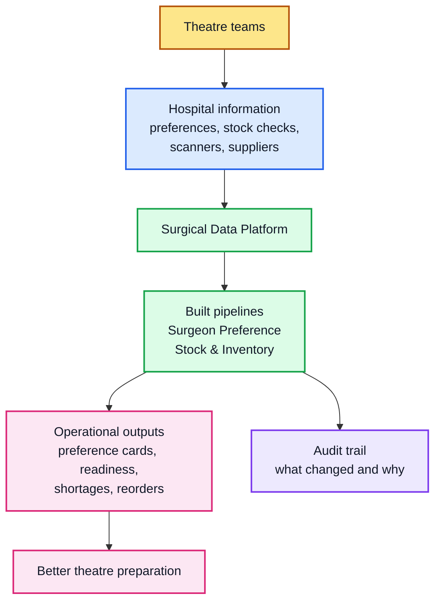
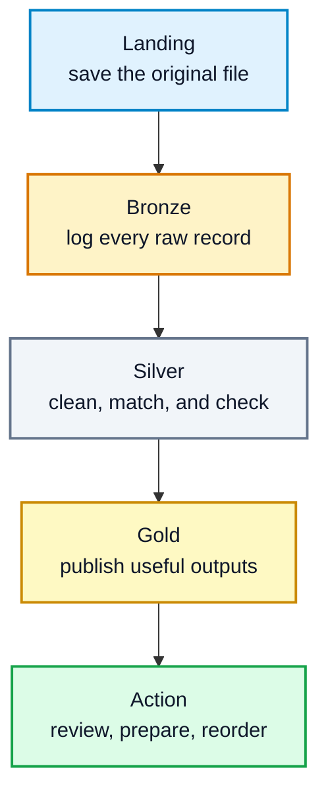
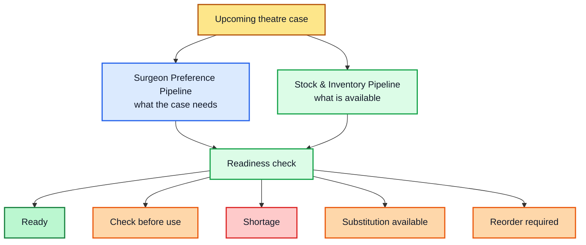

# Surgical Data Platform

This repository is a healthcare data engineering portfolio project built from
real operating theatre experience. It shows how everyday surgical workflow
problems can be turned into reliable data pipelines, dashboards, and operational
tools.

The platform is built mainly with **Python**, using it to generate realistic
synthetic data, clean messy source files, run the pipelines, publish outputs,
and power the dashboard services.

The project uses **synthetic data only**. It does not contain real patient data,
staff records, theatre lists, hospital stock records, or confidential hospital
information.

Live project site: [www.surgeonpreference.com](https://www.surgeonpreference.com)

---

## What This Platform Is For

Operating theatres depend on a lot of information being correct at the right
time: surgeon preferences, instruments, implants, consumables, theatre stock,
case lists, anaesthetic needs, equipment, and local team knowledge.

In many hospitals, this information is split across spreadsheets, paper notes,
stock cupboards, supplier systems, scanning systems, emails, and people's
memory. When the data is hard to trust, theatres can lose time checking,
chasing, substituting, delaying, or reordering things at short notice.

This platform explores how surgical operations data can be made:

- easier for theatre teams to review
- safer to audit
- cleaner for analytics
- reusable across connected pipelines
- ready for future cloud deployment and AI use cases

The aim is not just to store data. The aim is to support practical theatre
questions like:

- What does this surgeon need for this procedure?
- Are we ready for tomorrow's list?
- Which stock items are short, expired, recalled, or awaiting sterilisation?
- What can be substituted safely?
- What needs reordering?
- Which loan kits are required, confirmed, delivered, checked, and ready?
- Which procedures create the most cost or shortage pressure?

---

## Current Progress

Two operational pipelines have been built so far. A third, Loan Kit Management,
is the proposed next pipeline because it connects case requirements and stock
readiness with the supplier-managed equipment that must arrive for specific
operations.

### 1. Surgeon Preference Pipeline

**Status: Version 1 complete. Version 2 product workflow in progress.**

This pipeline turns messy surgeon preference information into operational
preference cards that theatre teams can use.

It produces structured cards showing:

- expected instruments and trays
- implants and implant systems
- consumables and disposables
- sutures and dressings
- equipment
- patient positioning
- anaesthetic notes
- skin preparation
- special instructions
- validation warnings and missing-item checks

Version 1 is complete as a working local and Azure-ready data product. It can:

- generate clinically realistic synthetic preference-card data
- process JSON and CSV source files
- clean and validate the data
- enrich records with clinical reference information
- publish operational preference-card outputs
- store audit and metadata records in Postgres
- write outputs to local MinIO or Azure Blob Storage
- run as a Dockerized batch job
- serve the latest preference cards through a Streamlit app
- run in Azure using Azure Blob Storage, Azure Postgres, Azure Container Apps,
  Azure Container Registry, and Azure Data Factory

Version 2 work is focused on turning the pipeline into a more controlled product
workflow:

- user sign-in and access requests
- organisation and role management
- draft preference-card edits
- review and publish workflow
- audit history for access, review, and publishing decisions

The pipeline is therefore functionally mature as a data product, while the
remaining work is mainly product workflow, access control, and governance.

### 2. Stock & Inventory Management Pipeline

**Status: Active build. Core local pipeline and dashboard foundations are now in place.**

This pipeline connects stock information with theatre demand. In simple terms,
the Surgeon Preference pipeline says, "This is what the surgeon expects for the
case." The Stock & Inventory pipeline asks, "Do we actually have it, is it safe
to use, and what should we do if we do not?"

The stock pipeline now includes:

- clinically aligned synthetic stock data generation
- manual spreadsheet-style stock checks
- scanner/barcode-style stock event files
- ERP-style stock balance files
- item catalogue, supplier, location, lot, expiry, recall, and sterility data
- Bronze ingestion for raw source files
- Silver normalisation and enrichment
- Gold outputs for readiness, shortages, reorder worklists, risk summaries,
  usage, cost, surgeon summaries, and procedure summaries
- integration points for Surgeon Preference Gold outputs
- local dashboard service and Streamlit dashboard foundations
- quality gates and cloud-readiness checks
- Docker and Container App Job scaffolding

The complete local test suite passes, and the core Azure resources and container
workloads have been created. Cloud hardening is still in progress: persistent
Blob and Postgres configuration, migration execution, managed identities,
end-to-end output verification, and dashboard validation remain before the
Azure deployment should be treated as complete.

### Shared Platform Foundation

The two pipelines now use a shared provider-neutral object-storage layer under
`platform/shared/storage`. It supports local S3/MinIO and Azure Blob Storage
while preserving each pipeline's existing import paths. This is the first
deliberate extraction of duplicated infrastructure into a reusable platform
capability. The shared storage tests and both complete pipeline test suites pass;
Docker image verification remains the final environment-level check.

---

## How The Pipelines Work

At a high level, the platform connects the information theatre teams already
use every day and turns it into practical readiness views.



Inside each pipeline, data moves through a simple "raw to ready" journey.



The technical name for this is a medallion pipeline:

- **Landing** means the original file is safely copied.
- **Bronze** means raw files and raw records are logged.
- **Silver** means data is cleaned, standardised, and checked.
- **Gold** means the output is ready for users, dashboards, or analysis.

For non-technical readers: each stage makes the data more trustworthy, while
keeping a record of where it came from.

---

## How The Two Built Pipelines Connect



Example:

1. A preference card says a total knee replacement needs a specific knee system,
   large orthopaedic set, cementing supplies, sutures, dressings, and drapes.
2. The stock pipeline checks item availability, expiry dates, recalls,
   sterility status, reserved stock, and substitutes.
3. The Gold output shows whether the case is ready, needs a stock top-up, needs
   a substitution review, or should be escalated.

This is the central direction of the platform: connected operational pipelines
that help theatre teams prepare earlier and act with better information.

---

## Proposed Next Pipeline: Loan Kit Management

**Status: Proposed and scoped; implementation has not started.**

A loan kit is a supplier-owned set of instruments, implants, trials, or related
equipment brought into a hospital for a particular procedure or operating list.
Unlike ordinary stock, a loan kit has a time-critical journey across the
hospital and supplier boundary: request, confirmation, dispatch, receipt,
contents check, decontamination or sterilisation, case allocation, use,
reconciliation, and return.

The proposed pipeline would combine:

- scheduled case and theatre-list information
- surgeon preference requirements
- requested kit, implant system, component, and size information
- supplier booking, confirmation, dispatch, and delivery events
- goods-received and contents-check records
- decontamination and sterilisation status
- case allocation and readiness decisions
- implants or components used, opened, missing, damaged, or unused
- collection, return, discrepancy, charge, and credit records

It would turn those events into a traceable status for every kit and case, with
clear ownership, deadlines, exceptions, and escalation worklists.

### Why This Pipeline Is Important

Loan kits sit at a difficult operational boundary. Theatre teams depend on them,
but the hospital does not control the whole supply chain. Information is often
spread across booking forms, emails, phone calls, theatre lists, supplier
systems, goods-received notes, decontamination records, and local spreadsheets.
A kit can be described as "booked" while still being unconfirmed, incomplete,
late, unchecked, unsterile, assigned to another case, or awaiting collection.

That uncertainty can cause avoidable list disruption, last-minute escalation,
procedure delays or cancellations, duplicate bookings, missing components,
unrecorded implant use, return disputes, and unnecessary charges. A dedicated
pipeline matters because ordinary inventory balances cannot represent this
time-sensitive chain of custody and responsibility.

The pipeline would connect the platform's two existing products:

1. Surgeon Preference identifies the kit or implant system a case requires.
2. Stock & Inventory determines what the hospital already holds and whether a
   safe substitute is available.
3. Loan Kit Management tracks the externally supplied kit from request through
   return when hospital stock cannot meet that requirement.

### Questions The Pipeline Will Answer

For upcoming cases and theatre teams:

- Which cases require a loan kit, and exactly which kit or implant system?
- Has the request been sent, accepted, and confirmed by the supplier?
- What is the delivery deadline after allowing enough time for checking and
  sterilisation?
- Has the correct kit arrived at the correct hospital for the correct case?
- Are all trays, instruments, implants, trials, sizes, and consumables present?
- Is the kit checked, decontaminated, sterile, and released for use?
- Is any case at risk because a kit is late, incomplete, damaged, or unconfirmed?
- Who owns the next action, and when should it be escalated?

For procurement, suppliers, and governance:

- Which kits are currently on site, in use, awaiting processing, or overdue for
  return?
- What was used or opened, and does that agree with the supplier record?
- Are any components missing, damaged, substituted, or disputed?
- Which suppliers, specialties, procedures, or sites create the most delays and
  exceptions?
- How often are kits booked but unused, duplicated, delivered late, or returned
  late?
- What charges, credits, cancellations, and avoidable costs are associated with
  each kit and case?
- Can the full chain of custody and decision history be reconstructed for audit?

The first useful release would focus on booking, milestones, readiness, alerts,
and return reconciliation. Predictive supplier performance and demand planning
would come later, after the operational event history is reliable.

---

## Platform Areas

The platform is organised into three families.

### Operational Pipelines

These support day-to-day theatre work.

- Surgeon Preference
- Stock & Inventory Management
- Case Scheduling
- Instrument & Tray Tracking
- Loan Kit and Instrument Management
- Anaesthetic Workflow
- Patient Pathway Tracking
- Theatre Workflow Orchestration
- Clinical Coding Support

### Intelligence Pipelines

These turn operational data into insight.

- Theatre Utilisation
- Turnaround Time
- Staffing Efficiency
- Brief and Debrief Compliance
- Cancellation and Delay Analysis
- Cost Per Case
- Surgeon Performance Insights
- Predictive Scheduling
- Device and Implant Analytics

### AI And Training Pipelines

These are strategic AI-facing pipelines that build on the operational data
foundation. They are planned around learning, simulation, robotics, and
AI-ready surgical datasets, with strong governance and safety controls.

- Surgical Video Hub
- Procedure Segmentation
- Skills Assessment Models
- Robotics Integration
- Instrument Usage Analytics
- Simulation and Training Data

---

## Current Repository Shape

```text
platform/
  modules/
    operational/
      surgeon_preference/
      stock_inventory/
    intelligence/
    ai_training/
  core/
  shared/

docs/
tests/
```

The two active operational modules are:

- `platform/modules/operational/surgeon_preference`
- `platform/modules/operational/stock_inventory`

Each module is designed to have its own source generation, ingestion, cleaning,
validation, publishing, dashboard, tests, and deployment path.

---

## Local And Cloud Direction

The platform is built to work locally first, then move to Azure.

### Local Development

Used for fast learning, testing, and iteration.

- synthetic data
- local files
- local object storage with MinIO
- local Postgres where needed
- Docker Compose
- Streamlit dashboards

### Azure Deployment

Used for cloud-style execution and production practice.

- Azure Blob Storage for data files
- Azure Postgres for audit and metadata
- Azure Container Registry for images
- Azure Container Apps and Container App Jobs for workloads
- Azure Data Factory for scheduling and orchestration
- Azure secrets and environment variables for configuration

The Surgeon Preference pipeline has already proven this Azure pattern. Stock &
Inventory should follow the same route once the local behaviour is stable.

---

## Why Synthetic Data Matters

Synthetic data allows the platform to be built safely without using real
hospital or patient information.

The synthetic data is designed to be realistic enough to test important
problems:

- messy spreadsheet columns
- different file formats
- missing or inconsistent item names
- expired stock
- recalled or quarantined stock
- reserved stock
- manual stock counts
- barcode scanner events
- surgeon-specific procedure demand
- substitutions and reorder rules

This makes the pipelines useful for learning, testing, and portfolio review
while keeping the project safe.

---

## Roadmap

### Foundations Completed

- build Surgeon Preference Version 1 as a local and Azure-capable data product
- build the Stock & Inventory local medallion pipeline, dashboard foundations,
  quality gates, metadata layer, and cloud deployment scaffolding
- connect stock readiness logic to Surgeon Preference demand outputs
- support local MinIO and Azure Blob Storage through one shared storage layer
- establish automated tests for the shared layer and both operational pipelines

### Current Priorities

- complete Stock & Inventory Azure hardening, including persistent Blob and
  Postgres configuration, migrations, managed identities, and end-to-end checks
- validate the deployed Stock & Inventory dashboard and published Gold outputs
- finish Surgeon Preference Version 2 access, draft, review, publish, and audit
  workflows
- strengthen cross-pipeline contracts, operational runbooks, monitoring, and
  deployment checks
- complete Docker image verification for both pipelines

### Next Operational Pipeline

Build the Loan Kit Management MVP in stages:

1. Define case, kit, supplier, booking, delivery, contents, sterilisation,
   allocation, use, and return data contracts.
2. Generate realistic synthetic source data and exception scenarios.
3. Build Landing, Bronze, Silver, and Gold processing with audit metadata and
   quality gates.
4. Connect Surgeon Preference requirements and Stock & Inventory availability
   to loan-kit decisions.
5. Publish readiness, late-delivery, incomplete-kit, action-owner, and overdue-
   return worklists through an operational dashboard.
6. Add supplier-performance, utilisation, discrepancy, and cost reporting after
   the core workflow is reliable.

### Later Platform Expansion

- add case scheduling plus instrument and tray tracking
- add theatre utilisation, turnaround-time, cancellation, delay, and cost-per-
  case analytics
- introduce stronger platform-wide governance and role-based access
- add Infrastructure-as-Code for repeatable environments
- connect to hospital-style systems through FHIR, HL7, ERP, vendor, and device
  integrations
- build prediction and AI-ready datasets only after operational data quality,
  governance, and clinical safety controls are mature

---

## Security And Data Safety

- Real patient data is not used.
- Real hospital stock data is not used.
- Secrets must be supplied through local environment variables or Azure secrets.
- `.env` files should not be committed.
- Generated data is for development, testing, and portfolio review.
- Any move toward real data would require proper governance, data protection,
  access control, clinical safety review, and organisation approval.

---

## Author

Joshua Ofori Donkor

- GitHub: **JoshuaOforisurg**
- Portfolio focus: surgical operations, biomedical science, theatre workflow,
  and healthcare data engineering
