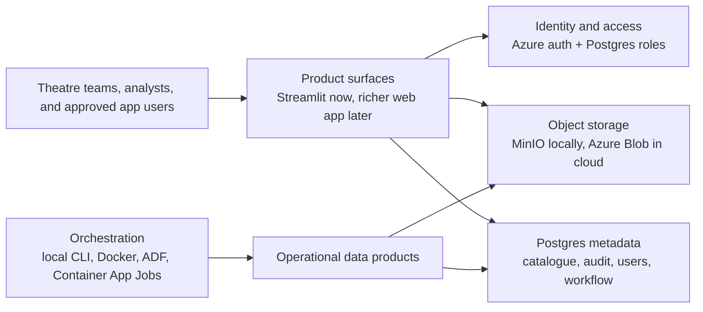
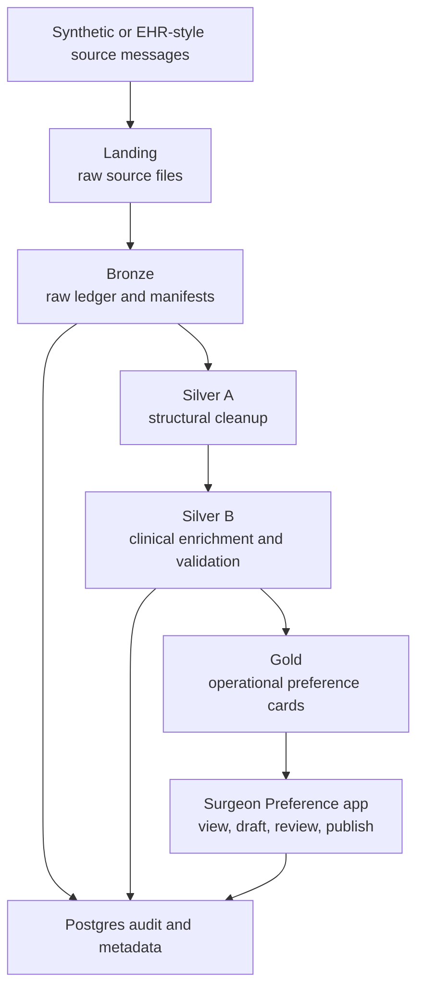
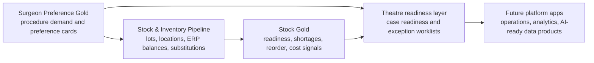

# Surgical Data Platform

## Portfolio Snapshot

This repository is a healthcare data engineering portfolio project built from
real operating theatre experience. It demonstrates how surgical workflow
problems can be translated into modular data pipelines, auditable data products,
and cloud-deployed operational tools.

The first completed module is the **Surgeon Preference Pipeline**, a version 1
operational data product that processes synthetic surgeon preference data
through landing, bronze, silver, and gold layers, publishes preference-card
outputs, and serves them through a Dockerized Streamlit app running on Azure.
Version 2 work is now focused on turning the demo surface into a controlled
product workflow with authentication, access requests, draft review, publishing,
and auditability.

The second active module is the **Stock & Inventory Management Pipeline**,
which is being built to connect preference-card demand with stock availability,
substitution options, reorder planning, and theatre readiness analytics.

Live demo: [www.surgeonpreference.com](https://www.surgeonpreference.com)

> This project uses synthetic data only. It does not contain real patient data,
> staff data, theatre lists, or hospital confidential information.

## Description

This platform is a unified, modular data platform for operating theatre operations, intelligence, and AI training.

From my personal experience working in the operating theatre, I found the "hidden" cost of care is often found in disjointed systems and manual, inconsistent documentation. This platform is designed from a clinical perspective to address these needs and create a single unified architecture that supports:

- Real-time theatre operations  
- Analytics and intelligence  
- AI and robotics training data  

All modules follow the same engineering lifecycle and share a common core.

## Why This Project Matters

Operating theatres generate valuable operational signals, but much of the work
is still fragmented across preference cards, stock checks, manual documents,
device systems, EHR events, and informal local knowledge. This platform explores
how data engineering can support safer and more efficient surgical operations
by making theatre data structured, traceable, and reusable.

The platform is intentionally built from a clinical operations perspective:

- surgeon preferences affect theatre readiness and case flow
- stock and implant availability affect delays and substitutions
- theatre utilisation depends on clean event and workflow data
- audit trails matter for clinical trust and operational review
- synthetic data is needed for safe development before real integrations

---

## Platform At A Glance



## Surgeon Preference Pipeline Flow



## Cross-Pipeline Direction



---

## Current Module Status

### Surgeon Preference Pipeline

**Version 1 complete. Version 2 in progress.**

Version 1 is complete as a standalone operational data product. It now runs
locally and in Azure, with a Dockerized Streamlit frontend, a dedicated
Container App Job for scheduled/manual batch execution, Azure Blob Storage
outputs, Azure Postgres metadata and audit tables, Azure Data Factory
orchestration, and a secured custom domain.

Current ingestion mode: scheduled/manual synthetic batch ingestion. The Azure
job generates 1000 clinically aligned source files, processes them through
landing, bronze, silver, and gold layers, and publishes the latest operational
preference cards for review.

Version 2 is adding the first product workflow layer:

- Azure-ready sign-in links for real users
- Postgres-backed user registry and organisation membership
- access request submission and admin approval
- role-based draft creation, review, publishing, and user management
- auditable workflow tables for access, reviews, publishes, and role changes

### Stock & Inventory Management Pipeline

**Active build.**

This is the next operational pipeline because it connects naturally to surgeon
preferences. Surgeon preference cards describe expected procedure demand;
inventory data shows actual consumable, implant, tray, supplier, lot, expiry,
reorder, and substitution availability. Together, both modules can support
shortage detection, substitution review, reorder planning, and theatre readiness
workflows.

The stock module currently includes:

- clinically aligned synthetic stock source generation
- realistic messy CSV and cleaner JSON/JSONL source files
- bronze ingestion with raw-file and record ledgers
- silver normalisation and enrichment
- gold readiness, shortage, reorder, risk, usage, surgeon, and procedure outputs
- a local Streamlit dashboard snapshot service
- quality gates and cloud-readiness preflight scaffolding

---

## Surgeon Preference Pipeline

The Surgeon Preference module currently demonstrates:

- synthetic clinical source generation at 1000-file scale
- JSON and CSV source ingestion
- landing, bronze, silver A, silver B, and gold processing
- clinical reference enrichment and validation
- FHIR example adapter for scheduled procedure messages
- PostgreSQL schemas for bronze metadata, pipeline audit, object catalogue, gold
  artifact tracking, and Iceberg catalogue bootstrap
- cloud-agnostic object storage abstraction for local MinIO and Azure Blob
- Dockerized Streamlit frontend for operational preference-card review
- dedicated Dockerized batch job image for pipeline execution
- Azure Blob Storage, Azure PostgreSQL, Azure Container Registry, Azure
  Container Apps, and Azure Data Factory orchestration learning path
- custom-domain deployment and revision/image troubleshooting
- version 2 access request workflow for real-user onboarding
- role-aware draft, review, publish, and administrator controls

Current ingestion mode is scheduled/manual synthetic batch ingestion. The active
engineering milestone is to harden real-user access on Azure, then connect the
Surgeon Preference output to the Stock & Inventory Management pipeline so
preference-card demand can be compared against stock, implant, tray, and
supplier availability.

## Stock & Inventory Pipeline

The Stock & Inventory module is designed as the operational sibling to Surgeon
Preference. It models the data needed to answer practical theatre questions:

- Is the required stock available for upcoming cases?
- Are any lots expired, quarantined, recalled, or awaiting sterilisation?
- Is there a clinically acceptable substitution?
- Which items need reorder action?
- Which surgeons, procedures, or specialties are most exposed to shortage risk?
- How do stock movements translate into issue, waste, return, and cost signals?

The first version remains local-first while the pipeline behaviour is being
hardened. Cloud deployment should follow the same pattern proven by Surgeon
Preference: containerized workloads, object storage, Postgres metadata, CI
checks, Azure runtime secrets, and clear preflight validation.

---

## Platform architecture

### Core layer

Shared functionality used by all modules:

- **Ingestion**  
- **Validation**  
- **Logging**  
- **Scheduling**  
- **Storage**  
- **Utilities**

---

### Module layer (pipeline categories)

#### Operational modules

Core pipelines that support day-to-day theatre operations:

- **Case Scheduling** (booking, lists, cancellations, overruns)  
- **Surgeon Preference** (procedure cards, pick lists)  
- **Instrument & Tray Tracking** (sterilisation, location, usage history)  
- **Loan Kit & Instrument Management** (vendor coordination, availability, returns)  
- **Anaesthetic Workflow** (pre-op, intra-op, recovery data)  
- **Stock & Inventory Management** (consumables, implants, auto-replenishment)  
- **Patient Pathway Tracking** (pre-op → theatre → recovery → discharge)  
- **Theatre Workflow Orchestration** (case progress, status updates, delays)  
- **Clinical Coding Support** (pipelines that process theatre data and help coders code faster)

#### Intelligence modules

Pipelines that provide analytics-ready data for theatre insights:

- **Theatre Utilisation** (room usage, idle time, block utilisation)  
- **Turnaround Time** (case-to-case efficiency, bottlenecks)  
- **Staffing Efficiency** (rosters vs actual demand, skill mix)  
- **Brief & Debrief Compliance** (checklists, safety signals)  
- **Cancellation & Delay Analysis** (root causes, trends)  
- **Cost Per Case** (linking consumables, staffing, time)  
- **Surgeon Performance Insights** (variation, duration benchmarks)  
- **Predictive Scheduling** (forecasting overruns, capacity planning)  
- **SurgiTrack Analytics** (tracking patient medical devices and implants for analytics)

#### AI & training modules

Pipelines that feed into ML models for surgical training and robotics:

- **Surgical Video Hub** (capture, storage, indexing, annotation)  
- **Procedure Segmentation** (AI labelling of surgical phases)  
- **Skills Assessment Models** (performance scoring, training feedback)  
- **Robotics Integration** (telemetry, motion data, system logs)  
- **Instrument Usage Analytics** (how tools are used during procedures)  
- **Simulation & Training Data** (synthetic or recorded training scenarios)

---

### Platform pipelines

“Glue” pipelines that connect the platform:

- **Data Integration Layer** (EHR, ERP, vendor systems, devices)  
- **Master Data Management** (patients, staff, instruments, procedures)  
- **Event Streaming / Real-Time Bus** (status updates across systems)  
- **Compliance & Audit Logging** (traceability, medico-legal requirements)  
- **Permissions & Access Control** (who sees what, especially video)  
- **Data Quality & Validation** (clean, consistent datasets)

---

### Shared layer

- **JSON schemas**  
- **Config files**  
- **Common models**

---

## Deployment modes

The platform supports two execution modes: **local** and **cloud (Azure)**.

### Local mode

Designed for rapid development and testing:

- Local JSON/CSV or SQLite storage  
- Local scheduler (cron / APScheduler)  
- Local logging  
- No cloud dependencies  
- Fast iteration and zero cost

Use this mode when developing pipelines, generating synthetic data, or testing schema validation.

---

### Cloud mode (Azure)

Designed for production-grade execution using Azure services.

#### Azure components

- **Azure Storage (Blob / ADLS Gen2)** — raw, validated, curated data layers  
- **Azure Functions** — ingestion, validation, event-driven triggers  
- **Azure Container Apps / AKS** — long-running or compute-heavy workloads  
- **Azure Event Grid / Service Bus** — real-time theatre workflow events  
- **Azure Key Vault** — secrets and credentials  
- **Azure Monitor / Application Insights** — logging, metrics, observability  
- **Azure SQL / Cosmos DB** — structured storage (future)

Cloud mode enables real-time, scalable, secure theatre data operations.

---

## Infrastructure-as-Code (IaC) layer

All Azure resources are provisioned using Infrastructure-as-Code to ensure reproducibility and consistent environments.

Recommended tools:

- Terraform (industry-standard, cloud-agnostic)  
- or **Bicep** (Azure-native)

#### IaC responsibilities

- Provision storage, compute, networking  
- Create dev/test/prod environments  
- Manage secrets and identity  
- Deploy event-driven architecture  
- Enforce consistent cloud deployments

Example structure:

```bash
infrastructure/
  terraform/        # or bicep/
    main.tf
    variables.tf
    outputs.tf
    modules/
```

---

## Mode switching

The Surgeon Preference pipeline currently switches storage backend from its
runtime environment:

```text
Local development: no AZURE_STORAGE_CONNECTION_STRING, so MinIO is used.
Azure deployment: AZURE_STORAGE_CONNECTION_STRING is set, so Azure Blob is used.
```

Pipelines share the same business logic but use different backends depending on
the configured environment variables.

### Cloud readiness gate

Before a cloud-facing change is merged, run the platform preflight:

```bash
python3 scripts/cloud_deployment_preflight.py
```

See [Cloud Deployment Readiness](docs/cloud-deployment-readiness.md) for the
CI gate, container validation checklist, image-build workflow, and required
runtime secrets. See [Deployment Scaffold](deployment/README.md) for cloud
runtime shape and environment templates.

---

## Repository structure

```text
theatre-data-platform/
├── README.md
├── docs/
│   ├── overview.md
│   ├── architecture.md
│   ├── modules.md
│   ├── cloud-deployment-readiness.md
│   ├── data-models.md
│   └── roadmap.md
├── platform/
│   ├── core/
│   ├── operational/
│   ├── intelligence/
│   └── ai-training/
├── infrastructure/
│   └── terraform/        # or bicep/
└── tests/
```

---

## Platform lifecycle

All modules follow the same lifecycle:

1. Ingest  
2. Validate  
3. Transform  
4. Log
5. Load  
6. Schedule  
7. Document

---

## Roadmap

- Finish Surgeon Preference V2 access hardening on Azure
- Build Stock & Inventory into a full medallion pipeline and dashboard
- Connect Surgeon Preference demand to Stock & Inventory readiness outputs
- Add cloud deployment gates for each new module
- Add monitoring, restore checks, and operational runbooks
- Add FHIR/HL7 integration where real hospital-style workflows need it
- Add Infrastructure-as-Code for repeatable dev/test/prod environments
- Add intelligence modules only after operational data contracts are stable
- Keep patient-identifiable data out of the platform until governance,
  tenancy, data protection, and clinical safety controls are mature

---

## Repository Hygiene And Security

- `.env` files are ignored and should never be committed.
- `.env.example` contains placeholders only.
- The project uses synthetic data for development and demonstration.
- Local secrets should be supplied through environment variables.
- Cloud secrets should be supplied through Azure Container App secrets or Azure
  Key Vault in a production setup.
- Generated caches, Mac system files, and local scratch files are excluded from
  the portfolio surface.

---

## Author

Joshua Ofori Donkor

- GitHub: **JoshuaOforisurg**
- Portfolio focus: surgical operations, biomedical science, theatre workflow,
  and healthcare data engineering
